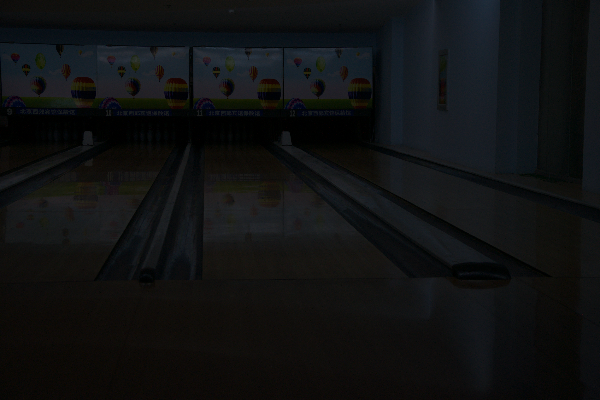
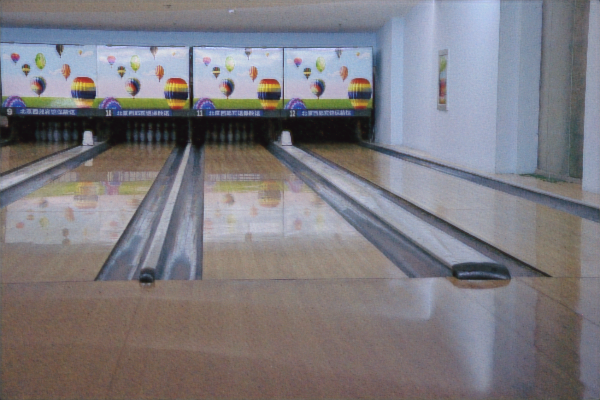

# Low-Light Image Reconstruction

Classical and learned methods for recovering well-lit images from
low-light photos, evaluated on the [LOL dataset](https://daooshee.github.io/BMVC2018website/),
with a Streamlit app to try any method on your own uploaded photos.

## Methods included

| Method | Script | Type |
|---|---|---|
| Histogram Equalization | (inline baseline, see `main.py` / `app.py`) | Classical baseline |
| MAP estimate with Total-Variation prior | `codes/02_map_tv.py` | Classical, denoising + prior |
| Poisson-noise denoising (Anscombe + BM3D) | `codes/03_poisson.py` | Classical, denoising |
| Sparse coding (learned dictionary of patches) | `codes/04_sparse.py` | Classical, dictionary learning |
| Deep Unfolding network (learned proximal-gradient solver) | `codes/05_deep_unfolding.py` | Deep learning |

See [`METHODOLOGY.md`](METHODOLOGY.md) for how each method actually works.

## Project layout

```
.
├── app.py                        # Streamlit interface (upload an image, see all results)
├── requirements.txt
├── README.md
├── METHODOLOGY.md
└── codes/
    ├── config.py                 # all dataset/results paths, override-able via env vars
    ├── utils.py                  # shared helpers (safe image loading, gamma/white-balance)
    ├── 02_map_tv.py
    ├── 03_poisson.py
    ├── 04_sparse.py
    ├── 05_deep_unfolding.py      # train once, reuse the checkpoint after that
    ├── 06_metrics.py             # PSNR / SSIM
    ├── main.py                   # runs every method on one eval image + prints metrics
    └── test_deep_unfolding.py    # quick smoke test for a trained checkpoint
```

## Setup

```bash
python -m venv venv
source venv/bin/activate        # Windows: venv\Scripts\activate
pip install -r requirements.txt
```

## Dataset paths

`codes/config.py` expects the LOL dataset laid out as:

```
<DATASET_ROOT>/our485/low     <- training low-light images
<DATASET_ROOT>/our485/high    <- training ground-truth images
<DATASET_ROOT>/eval15/low     <- evaluation low-light images
<DATASET_ROOT>/eval15/high    <- evaluation ground-truth images
```

By default this resolves to:

```
D:\Projects\LowLight_Reconstruction\Dataset\LOLdataset\our485\low
D:\Projects\LowLight_Reconstruction\Dataset\LOLdataset\our485\high
```

and the eval15 equivalents. You can point anywhere else without editing
`config.py`, via environment variables:

```bash
# Windows (PowerShell)
$env:LOWLIGHT_PROJECT_ROOT = "D:\Projects\LowLight_Reconstruction"
$env:LOLDATASET_ROOT       = "D:\Projects\LowLight_Reconstruction\Dataset\LOLdataset"

# macOS/Linux
export LOWLIGHT_PROJECT_ROOT=/path/to/LowLight_Reconstruction
export LOLDATASET_ROOT=/path/to/LowLight_Reconstruction/Dataset/LOLdataset
```

## Running the classical methods + metrics

```bash
cd codes
python main.py
```

This runs Histogram Equalization, MAP-TV, Poisson/BM3D and Sparse Coding
on the first image in `eval15/low`, saves each result under
`<PROJECT_ROOT>/results/`, and prints PSNR/SSIM for each against
`eval15/high`.

## Using your GPU (recommended - e.g. RTX 4060)

`pip install torch` from `requirements.txt` installs a **CPU-only**
build on Windows by default, so you need to explicitly install a
CUDA-enabled build to get GPU training:

```bash
pip uninstall torch
pip install torch --index-url https://download.pytorch.org/whl/cu124
```
(cu124 = CUDA 12.4, compatible with an RTX 4060's drivers as of writing;
check https://pytorch.org/get-started/locally/ for the current
recommended command/CUDA version for your setup.)

Verify it's actually being used:
```bash
python -c "import torch; print(torch.cuda.is_available(), torch.cuda.get_device_name(0))"
```
`05_deep_unfolding.py` auto-detects CUDA and prints a warning if it
falls back to CPU.

## Training the Deep Unfolding network (once)

```bash
cd codes
python 05_deep_unfolding.py
```

- First run: trains on `our485` for up to 60 epochs by default (holding
  out a small validation slice), and after every epoch saves the
  checkpoint to `<PROJECT_ROOT>/results/deep_unfolding_model.pt`
  **only if that epoch's validation PSNR is the best seen so far** - so
  the file you end up with is the best-generalizing checkpoint, not
  just whatever the model looked like after the last epoch.
- **Every run after that**: if a compatible checkpoint already exists,
  training is **skipped automatically** and the saved weights are
  reused - you do not need to retrain each time you run `main.py`,
  `app.py`, or this script again.
- To force a fresh retrain (e.g. after changing the architecture or
  getting more data), or to override the training knobs:
  ```bash
  python 05_deep_unfolding.py --retrain
  python 05_deep_unfolding.py --retrain --epochs 100
  python 05_deep_unfolding.py --retrain --batch-size 8 --crop-size 128   # if you hit an out-of-memory error
  ```
- If you upgrade the code and the saved checkpoint's architecture no
  longer matches (e.g. `N_STAGES`/`N_FEATURES` changed - as they did in
  this pass, 3→5 stages and 64→96 features), the script/app detects the
  mismatch, tells you, and treats it as "no checkpoint" rather than
  crashing - just retrain with `--retrain`.

Once trained, `main.py` will automatically pick up the checkpoint and
include Deep Unfolding results in its table; if no checkpoint exists yet
it just tells you to train it first, instead of failing.

### What changed to push PSNR higher

- **Best-checkpoint saving.** The model is evaluated on a held-out
  validation slice of `our485` after every epoch; only improvements are
  saved. This alone tends to matter a lot once you train for more
  epochs, since later epochs can start overfitting the training crops.
- **Loss re-weighted toward MSE** (`loss = 0.2*L1 + 1.0*MSE`), since
  PSNR is a direct function of MSE - the model is now more directly
  optimizing the metric you care about, instead of pure L1.
- **More capacity** (5 stages, 96 features vs. the previous 3/64) and
  **more training** (60 epochs, 192px crops, batch size 16, all sized
  for a GPU) so the model has both the room and the data exposure to
  actually learn the mapping well.
- **Flip/rotation augmentation** on every training crop, to get more
  effective variety out of the same 485 training pairs.
- **Mixed precision (AMP)** on CUDA, so the larger crops/batches above
  train in a similar amount of wall-clock time as the smaller old setup
  did on CPU.

If you want to push further: try more epochs (`--epochs 100`+, cheap on
a GPU), or edit `L1_WEIGHT`/`MSE_WEIGHT` at the top of
`05_deep_unfolding.py` (raising `MSE_WEIGHT` pushes PSNR up further but
can start looking slightly blurrier; raising `L1_WEIGHT` trades back
some sharpness for a bit of PSNR).

## Try it yourself: the Streamlit app

```bash
streamlit run app.py
```

Then open the local URL Streamlit prints (usually `http://localhost:8501`).
From there you can:

- Upload any low-light photo.
- Optionally upload a matching well-lit / ground-truth image to also see
  PSNR and SSIM.
- Toggle which methods to run (Poisson/BM3D and Sparse Coding are the
  slowest - uncheck them for a quick look).
- View every method's output side by side and download any of them.

The app works on whatever image you upload - it does not require the
LOL dataset to be present, **except** for Deep Unfolding, which needs a
checkpoint that was trained on `our485` beforehand (see previous
section).

## Demo Video

https://github.com/user-attachments/assets/80217429-e72c-48ae-8c10-b95f6a3c250b

## Results

### Low Light Enhancement Comparison
Low light image



Image after deep unfolding


